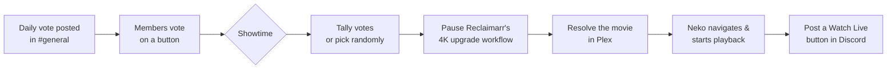

<p align="center">
  
</p>

<p align="center">
  
  
  
  
</p>

Servarr is a self-hosted Discord bot for a home media server community — the "everything else" bot alongside your request bot: release calendars, activity leveling, moderation utilities, and a fully automated **Movie Night**.

- 📅 **Release calendars** — posts upcoming movie/TV/anime releases to their own channels, pulled straight from Radarr/Sonarr.
- 🏆 **Activity leveling** — XP for chatting, `/rank` and `/leaderboard`, tunable earn rate and cooldown.
- 🛡️ **Moderation** — `/kick`, `/ban`, `/timeout`, `/warn` (DMs the member and logs it), with an optional mod-log channel.
- 📺 **Now-playing awareness** — watches Plex/Tautulli activity in the background.
- 🍿 **Movie Night** — the flagship feature: once a day, posts a vote among already-downloaded movies; at showtime, tallies the vote (or picks randomly if nobody voted), pauses any 4K-upgrade automation so nothing gets interrupted mid-movie, and — if you've set up [Neko](https://github.com/m1k1o/neko) as a shared viewing browser — automatically navigates it to the winning movie and hits play, then posts a one-click "Watch Live" link. Zero manual steps once it's configured.

## Quick start

**You'll need:** Docker + Docker Compose, a Discord bot application (see below), and at least one of Sonarr/Radarr/Plex/Tautulli if you want those features.

```bash
git clone https://github.com/spongebobmoviept-lab/Servarr.git
cd Servarr
docker-compose up -d
```

Open `http://<this-machine's-ip>:8888` and follow the setup wizard:

1. Create your login
2. Connect Discord (bot token + optional server ID for instant command sync)
3. Connect Radarr &amp; Sonarr — optional, powers the release calendar
4. Connect Plex &amp; Tautulli — optional, powers the now-playing monitor
5. Movie Night — optional, connects Reclaimarr (so upgrades pause during showtime) and Neko (the shared browser that actually plays the movie)
6. Fine-tune Movie Night timing, XP rates, and the mod-log channel — all ship with sensible defaults
7. Done

Only the admin login and a Discord bot token are required to finish setup — every other step can be skipped and configured later by revisiting `/setup`, which doubles as the settings page once you're logged in.

### Getting a Discord bot token

1. [Discord Developer Portal](https://discord.com/developers/applications) → **New Application**.
2. **Bot** tab → **Reset Token** → copy it.
3. Under **Privileged Gateway Intents**, enable **Message Content Intent** and **Server Members Intent** — Servarr needs both.
4. **OAuth2 → URL Generator**: check `bot` and `applications.commands`, pick permissions, open the generated URL to invite it to your server.
5. Enable Developer Mode (User Settings → Advanced) to copy your server ID for instant command sync.

## Movie Night, in more detail



Neko itself isn't part of this repo — it's a separate, self-hosted shared browser (one Docker container, `m1k1o/neko:chromium`) that broadcasts a live view to anyone with the link, the same way Watch Together tools do. Set it up separately, log into Plex Web inside it once, then point Servarr's wizard at it. If you skip Neko entirely, Movie Night still runs the vote and announcement — it just won't auto-start playback anywhere.

## Configuration reference

Everything below is set through the setup wizard or by revisiting `/setup` later — you shouldn't need to hand-edit config files.

| Setting | Default | What it does |
|---|---|---|
| Movie Night vote hour (UTC) | 22 | When the daily vote posts |
| Movie Night play hour (UTC) | 1 | When the winner is announced/played |
| Movies offered per vote | 5 | How many candidates show up in the vote |
| 4K-upgrade pause during Movie Night | 240 min | How long Reclaimarr's upgrades stay paused |
| XP per message | 15–25 | Random range awarded per eligible message |
| XP cooldown | 60 sec | Minimum time between XP-earning messages per person |
| Mod-log channel | — | Where kick/ban/timeout/warn actions get logged (optional) |

## FAQ

**Do I need Neko for Movie Night to work at all?**
No — the vote and announcement work without it. Neko is only needed for the "starts playing automatically, click a link to watch together" part.

**Can I run this without Radarr or Sonarr?**
Yes, both are optional. Skip them in the wizard; the calendar and Movie Night features that depend on them just won't have anything to show until you connect one.

**Does Servarr control Plex directly?**
Only through Neko, and only by driving the shared browser the same way a person would (Plex's own remote-control API doesn't work against browser sessions — confirmed, not a limitation of this bot). Tautulli/Plex connections elsewhere are read-only (for the now-playing monitor).

**Can I change settings after setup?**
Yes — revisit `/setup` any time, log in, and jump to any section. Nothing about it is one-time except creating the initial admin login.

## Troubleshooting

- **The container won't start / crashes immediately.** Check `docker-compose logs -f servarr`.
- **The wizard's "Test & Continue" fails.** Double check the URL includes `http://` and the correct port, and that it's reachable *from inside the container* — `localhost` almost never works here, use the machine's real LAN IP.
- **Slash commands aren't showing up in Discord.** Without a server (guild) ID, commands sync globally, which can take up to an hour. Add the guild ID in the wizard's Discord step for instant sync.
- **Found a bug or want a feature?** Open an issue on this repo.

## Design principles

- One Python process, one container, no database, no build step.
- Every feature degrades gracefully when its optional dependency isn't configured — nothing crashes because Plex or Neko isn't set up.
- Movie Night never gets stuck mid-flow: a failed automation step just falls back to a plain link, the announcement always goes out.
