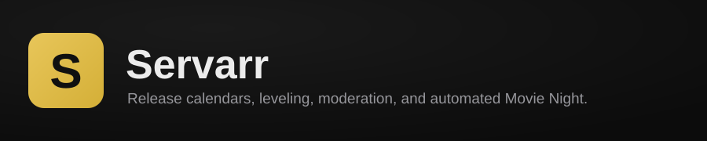

<p align="center">
  
</p>

<p align="center">
  
  
  
  
</p>

Servarr is a self-hosted Discord bot for a home media server community — the "everything else" bot alongside your request bot: release calendars, activity leveling, moderation utilities, and a fully automated **Movie Night**.

- 📅 **Release calendars** — posts upcoming movie/TV/anime releases to their own channels, pulled straight from Radarr/Sonarr, and keeps each digest at the bottom of its channel even when other bots post there.
- 🏆 **Activity leveling** — XP for chatting, `/rank` and `/leaderboard`, tunable earn rate and cooldown, plus a live top-10 board that updates itself in your leaderboard channel.
- 🛡️ **Moderation** — `/kick`, `/ban`, `/timeout`, `/warn` (DMs the member and logs it), with an optional mod-log channel.
- 📺 **Now-playing awareness** — watches Plex/Tautulli activity in the background.
- 🍿 **Movie Night** — the flagship feature: once a day, posts a vote among already-downloaded movies with a live tally (the vote survives restarts); at showtime, tallies the vote (or picks randomly if nobody voted), pauses [Reclaimarr](https://github.com/spongebobmoviept-lab/Reclaimarr)'s 4K upgrades so nothing gets interrupted mid-movie, and — if you've connected an optional player — starts the movie and posts a one-click "Watch Live" link. DJs get slash commands, buttons, a search box, and a web remote to control playback.

## Quick start

**You'll need:** Docker with Docker Compose v2.24 or newer, a Discord bot application (see below), and at least one of Sonarr/Radarr/Plex/Tautulli if you want those features. Nothing to build: a ready-made image is published for **amd64** and **arm64** (including Raspberry Pi 4/5 on a 64-bit OS).

```bash
mkdir -p servarr/data && cd servarr
curl -fsSLO https://raw.githubusercontent.com/spongebobmoviept-lab/Servarr/main/docker-compose.yml
curl -fsSL -o .env.example https://raw.githubusercontent.com/spongebobmoviept-lab/Servarr/main/.env.example
docker compose up -d
```

The container runs as uid/gid 1000 by default, so `data/` must be writable by that user. If yours differ, put `PUID=` and `PGID=` (from `id -u` / `id -g`) in a `.env` file. Otherwise you don't need a `.env`: everything is set in the web setup page.

**Want Movie Night to actually play movies?** Use the [Movie Night player](https://github.com/spongebobmoviept-lab/movienight-player) bundle compose instead: it runs the player and Servarr together and pairs them automatically.

Open `http://<this-machine's-ip>:8888` and follow the setup wizard. Every connection is tested live, with a plain-English explanation if something's wrong:

1. Create your login
2. Connect Discord — paste the bot token, click **Find my servers**, pick yours from the list (an **Invite it** link appears if the bot isn't in it yet)
3. Connect Radarr &amp; Sonarr — optional, powers the release calendar
4. Connect Plex &amp; Tautulli — optional, powers the now-playing monitor and the web remote's library browser
5. Movie Night — optional: connect Reclaimarr (so upgrades pause during showtime) and pair the player by pasting its pair code
6. Fine-tune: Movie Night timing, DJ role, control/leaderboard/mod-log channels (all picked from dropdowns of your real server), XP rates
7. Done

Only the admin login and a Discord bot token are required to finish setup — every other step can be skipped and configured later by revisiting `/setup`, which doubles as the settings page once you're logged in.

### Getting a Discord bot token

1. [Discord Developer Portal](https://discord.com/developers/applications) → **New Application**.
2. **Bot** tab → **Reset Token** → copy it.
3. Under **Privileged Gateway Intents**, enable **Message Content Intent** and **Server Members Intent** — Servarr needs both.
4. **OAuth2 → URL Generator**: check `bot` and `applications.commands`, pick permissions, open the generated URL to invite it to your server.
5. You don't need the server ID: the setup page lists the servers the bot is in.

## Movie Night, in more detail


Without a player, Movie Night still runs the vote and the announcement; it just doesn't start playback anywhere.

### DJ controls

Anyone with **Manage Server**, or the **Movie Night DJ role** you pick in the wizard (role ID or name), can control playback:

| Command | What it does |
|---|---|
| `/play-movie <title>` / `/stop-movie` | Start a specific downloaded movie now / stop playback |
| `/mpv-play <title>` | Start a movie and get private Watch Live + web-remote links |
| `/mpv-pause`, `/mpv-resume`, `/mpv-seek`, `/mpv-stop` | Transport controls |
| `/movie-night`, `/movie-night-play` | Mods only: post tonight's vote now / tally and start now |

The "Now playing" message also has pause/seek/stop buttons (DJs only). If a channel named after `MOVIE_NIGHT_CONTROL_CHANNEL` (default `movie-night-control`) exists **and is hidden from @everyone and the Member role**, Servarr keeps a DJ control panel there with the same buttons, a **Search & Play** box, and the admin player link. It refuses to post there if the channel is visible to everyone, because the admin link carries the player's admin password. Anyone else pressing a DJ button gets a quiet "no", and blocked slash-command attempts are logged to the mod-log channel.

### Web remote (`/mpv-remote`)

A small phone-friendly page with play/pause, ±10 s, stop, search, library browsing, TV seasons/episodes and "continue watching". DJs get a link like `https://servarr.example.com/mpv-remote#key=…` from `/mpv-play`.

- The remote key is generated for you on first start. Set "This Servarr's address" in the setup page (Movie Night step) to the address DJs use.
- The key is in the URL **fragment** (after `#`), which browsers never send to the server, so it doesn't end up in access logs or proxies. The page sends it in an `X-Remote-Key` header, trades it once for an HttpOnly cookie (`POST /api/mpv/login`), and removes it from the address bar.
- Without `MPV_REMOTE_KEY`, the page asks for the admin login instead.
- **Changed in 1.1:** the key is no longer accepted as a `?key=` query parameter by the API. Old `?key=` links still open the page, which picks the key up client-side, but new links use `#key=`.

### Movie Night player (optional)

Servarr doesn't play video itself. Pair it with a player and Movie Night starts the movie for everyone:

- **[Movie Night player](https://github.com/spongebobmoviept-lab/movienight-player)** (recommended). Its bundle compose runs the player next to Servarr and pairs them automatically through a shared `pair.json`. Running it separately? Copy the **pair code** (`MNP1-…`) from the player's setup page and paste it in Servarr's setup page (Movie Night step). The player signs in to Plex itself and gives Servarr ready-made watch links.
  - Servarr calls its control API at `<player>/movienight/api/v1/…` (`status`, `play`, `pause`, `resume`, `stop`, `seek`, `links`, `pair`) with the key in an `Authorization: Bearer` header. The key never goes in a URL.
- **A plain Plex Companion player**, such as [plex-mpv-shim](https://github.com/iwalton3/plex-mpv-shim), works too: enter its address (no key), and the watch page's URL and optional passwords under "Using a plain Plex Companion player?". Servarr then resolves movies in its own Plex connection and calls `GET /player/playback/playMedia`, `/player/timeline/poll`, `/player/playback/pause|play|stop` and `/player/playback/seekTo`. It sends your Plex token to the player so it can stream, so keep that player on your LAN. With a watch page such as a [Neko](https://github.com/m1k1o/neko) virtual browser, Servarr adds `/?pwd=<password>` for one-click login; the admin variant only ever goes to DJs.

Without a paired player, the player commands answer "nothing playing", the `/api/mpv/*` control endpoints return 503, and everything else works normally.

## Configuration reference

Everything below is set through the setup wizard or by revisiting `/setup` later — you shouldn't need to hand-edit config files.

| Setting | Default | What it does |
|---|---|---|
| Movie Night vote hour (UTC) | 22 | When the daily vote posts |
| Movie Night play hour (UTC) | 1 | When the winner is announced/played |
| Movies offered per vote | 5 | How many candidates show up in the vote |
| 4K-upgrade pause during Movie Night | 240 min | How long Reclaimarr's upgrades stay paused |
| XP per message | 15–25 | Random range awarded per eligible message |
| XP cooldown | 60 sec | Minimum time between XP-earning messages per person |
| Mod-log channel | — | Where kick/ban/timeout/warn actions get logged (optional) |
| Movie Night DJ role | — | Role (ID or name) allowed to control playback, besides Manage Server |

### Environment settings (`.env`)

All optional and mostly also editable in the setup page; see `.env.example`.

| Variable | Default | What it does |
|---|---|---|
| `PUID`, `PGID` | `1000` | User the container runs as; must own `data/`. |
| `MOVIE_NIGHT_CONTROL_CHANNEL` | `movie-night-control` | Private DJ/mod channel for the control panel and admin link (also picked in the setup page). |
| `LEADERBOARD_CHANNEL` | `leaderboard` | Channel for the self-updating top-10 board (setup page). |
| `EXTRA_READ_ONLY_CHANNELS` | empty | More channels to make read-only (comma-separated) when you run `/setup-server` (setup page). |
| `PINNED_TILE_CHANNEL`, `PINNED_TILE_TITLE_MATCH` | empty (off) | (Setup page, advanced.) Keep another bot's self-editing webhook tile (say, a status board) at the bottom of a channel dedicated to it: when anything else posts after the tile, Servarr deletes the stale tile so its owner re-posts it, and removes stray posts while no tile exists. Only use it if that bot re-posts when its message is deleted. Needs Manage Messages. |
| `PLAYER_URL`, `PLAYER_KEY` | empty | Fallback for the player pairing normally done in the setup page. |
| `PLAYER_PAIR_FILE` | `/pair/pair.json` | Pairing file a bundled player exports; read on start if no player is paired. |
| `PLAYER_VIEWER_URL`, `PLAYER_VIEWER_PASSWORD`, `PLAYER_ADMIN_PASSWORD` | empty | Plain Companion players only: the watch page. (The older `NEKO_MPV_*` names still work.) |
| `SERVARR_PUBLIC_URL` | `http://localhost:8888` | Base URL for the `/mpv-remote` links (also set in the setup page). |
| `MPV_REMOTE_KEY` | generated | Secret for the web remote; generated and saved on first start if unset. |
| `CORS_ALLOWED_ORIGINS` | empty | Extra browser origins allowed to call Servarr. |

## HTTP API

Everything except `/health`, `/setup`, `/api/setup/status`, the one-time `/api/setup/admin` and `/mpv-remote` needs the admin login (HTTP Basic). The `/api/mpv/*` endpoints also accept the remote key.

- `POST /api/release-digest/force` — post the release calendars now.
- `POST /api/movie-night/force` — tally (or pick) and start tonight's movie now.
- `POST /api/mpv/login` `{"key": "…"}` — exchange the remote key for a cookie.
- `POST /api/setup/pair-player` `{"url": "MNP1-…"}` (or `{"url", "key"}`) — test and save a player.
- `GET /api/mpv/status`, `/api/mpv/search?q=`, `/api/mpv/sections`, `/api/mpv/browse/{section}`, `/api/mpv/children/{ratingKey}`, `/api/mpv/poster/{ratingKey}`, `/api/mpv/on-deck`
- `POST /api/mpv/play` `{"title", "year"}`, `/api/mpv/play-item` `{"rating_key", "offset_ms"}`, `/api/mpv/pause`, `/api/mpv/resume`, `/api/mpv/stop`, `/api/mpv/seek` `{"delta_seconds"}`

## FAQ

**Do I need a player for Movie Night to work at all?**
No — the vote and announcement work without it. A player is only needed for the "starts playing automatically, click a link to watch together" part.

**Can I run this without Radarr or Sonarr?**
Yes, both are optional. Skip them in the wizard; the calendar and Movie Night features that depend on them just won't have anything to show until you connect one.

**Does Servarr control Plex directly?**
No. It reads your Plex library (search, browse, posters) and tells a Plex Companion player what to play; Tautulli is read-only (for the now-playing monitor).

**Can I change settings after setup?**
Yes — revisit `/setup` any time, log in, and jump to any section. Nothing about it is one-time except creating the initial admin login.

## Troubleshooting

- **The container won't start / crashes immediately.** Check `docker compose logs -f servarr`. A `PermissionError` on `/data` means `data/` isn't writable by uid 1000 (or your `PUID`). An error about `env_file` means Compose is older than v2.24; update it or create an empty `.env`.
- **"The player rejected Servarr's pairing key".** The player's key was rotated. Copy its pair code again and paste it in the setup page.
- **The DJ control panel never appears.** The control channel must exist and be hidden from @everyone and the Member role; the log says so if it isn't.
- **The wizard's "Test & Continue" fails.** Double check the URL includes `http://` and the correct port, and that it's reachable *from inside the container* — `localhost` almost never works here, use the machine's real LAN IP.
- **Slash commands aren't showing up in Discord.** Without a server (guild) ID, commands sync globally, which can take up to an hour. Add the guild ID in the wizard's Discord step for instant sync.
- **Found a bug or want a feature?** Open an issue on this repo.

## Building from source

Clone the repo and run `docker build -t servarr .`, or in `docker-compose.yml` swap the `image:` line for the commented `build:` line and run `docker compose up -d --build` (no clone needed). To update the prebuilt image, change the tag on the `image:` line (or use `:latest`) and run `docker compose pull && docker compose up -d`.

Run the tests with:

```bash
git clone https://github.com/spongebobmoviept-lab/Servarr.git && cd Servarr
docker build -t servarr .
docker run --rm -v "$PWD/tests:/app/tests:ro" -w /app servarr python -m unittest discover -s tests -t .
```

## Security notes

- The web UI and API use HTTP Basic auth over plain HTTP. Keep Servarr on your LAN, or put it behind a reverse proxy with HTTPS (needed anyway if friends use the web remote from outside). Failed logins and wrong remote keys are throttled per IP.
- On a fresh install, the wizard's "create admin" step is open until an admin exists; finish setup right after the first start.
- Cross-origin requests are only answered for the player's own origins and `CORS_ALLOWED_ORIGINS`; cross-origin POSTs from anywhere else are refused (CSRF protection).
- The remote key never goes in a query string; secrets (Plex token, API keys, `pwd=`, `key=`, webhook URLs) are redacted from the log.
- The admin player link is only sent in ephemeral replies, DMs, or a control channel Servarr has verified is private.
- The player pairing key travels only in an `Authorization` header, server to server. A plain Companion player receives your Plex token to stream; keep it on your LAN.
- The "Test" buttons in the wizard make requests to whatever URL you type; they require the admin login.
- The container runs as a non-root user.

## Design principles

- One Python process, one container, no database, nothing to build.
- Every feature degrades gracefully when its optional dependency isn't configured — nothing crashes because Plex or the player isn't set up.
- Movie Night never gets stuck mid-flow: a failed automation step just falls back to a plain link, the announcement always goes out.
